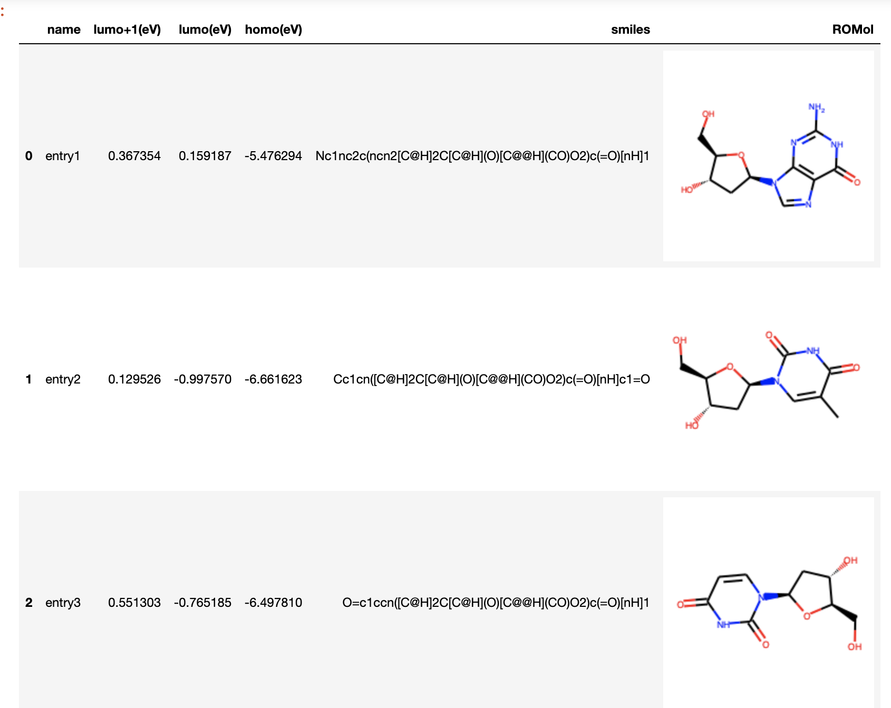
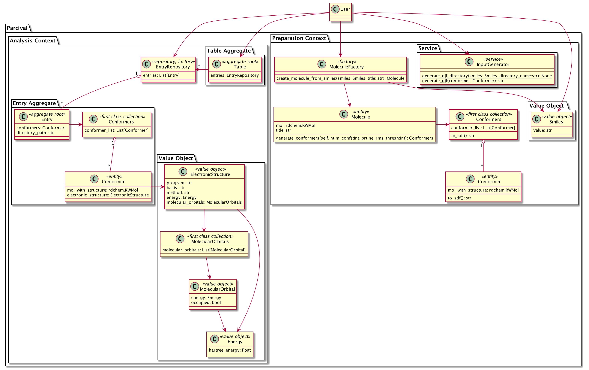

Percival
========================

自身の計算化学の研究で補助的に使っている関数をまとめたpythonライブラリ。
ドメイン駆動設計（DDD）を用いることで、アジャイル開発をしやすくする（願望）。

## コンテキストマップ

DDDでははじめに、ドメイン（計算化学）的なコンテキストに分けることでコンテキスト毎に独立して開発できるようにする。

- Preparationコンテキスト
    - インプットファイルを良い感じにフォルダ分けして生成するためのモジュール
    - （機能１）SMILESからGaussianのinputファイル(HF/hf/3-21g最適化の後、B3LYP/6-31g(d)で再最適化)を生成する。
- Analysisコンテキスト
    - 先のインプットや別口のインプットで行われた計算をフォルダ毎に抽出してTableにまとめるためのモジュール
    - （機能１）フォルダ名のリストを入力に、各フォルダの内部のgaussianの計算結果ファイルを抽出し、代表的な構造(エネルギーが最低の構造)のデータをTableにする。
    
## インストール

```bash
python>=3.7
rdkit
openbabel
```

```bash
conda install -c rdkit rdkit
conda install -c openbabel openbabel
```

```bash
pip install git+https://github.com/kyusque/percival
```

## 使い方

### Preparationコンテキスト

Smilesから、MMFFでコンフォメーションを生成し、Smilesごとに名前をつけたフォルダにgjfファイルとして保存する。
gjfの内容はHF/hf/3-21g最適化の後、B3LYP/6-31g(d)で再最適化。

```python
from percival.preparation.service.input_generator import InputGenerator
from percival.preparation.value_object.input import Smiles

dictionary = {"entry1": "CC", "entry2": "CCC", "entry3": "O"}
for key, value in dictionary.items():
    # フォルダ毎にSMILESから生成した構造のgaussianのインプットファイル(.gjf)が複数個以上生成。
    InputGenerator.generate_gjf_directory(Smiles(value), key)

```

```bash
TODO: bashで一気に計算を流す方法書く
```

### Analysisコンテキスト

gaussianのログファイルが入っているフォルダのパスのリストからテーブルを生成する。
とりあえずは、LUMO+1,LUMO,HOMOを生成するようにした。

```python
from percival.analysis.domain.entry import EntryRepository
from percival.analysis.domain.table import Table
from rdkit.Chem import PandasTools

dir_paths = ["tests/resources/entries/entry{}".format(i) for i in range(1,4)]
entries = EntryRepository.get_entries(dir_paths)
table = Table(entries)
data = table.to_dataframe()
PandasTools.AddMoleculeColumnToFrame(data, "smiles")
data

```
下のような形で出るはずです。



## 設計方針

ドメイン駆動設計（DDD）を用いた。

詳細については順次追加していく予定。

